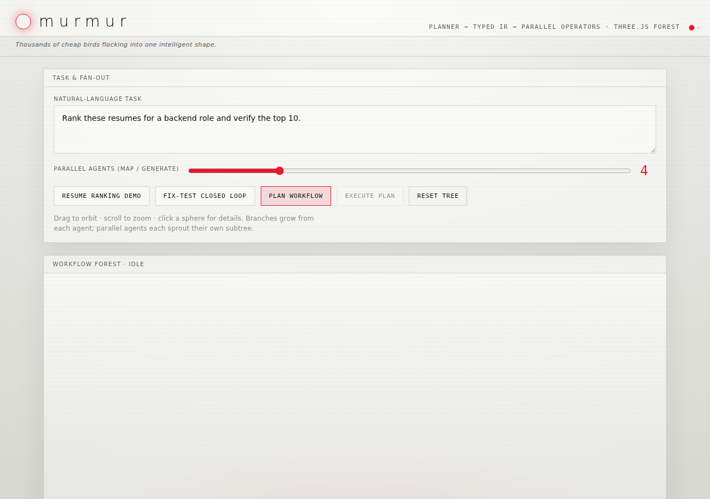
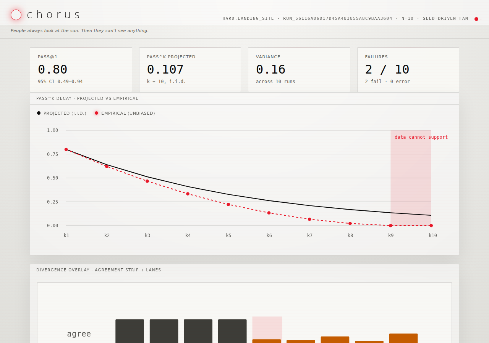
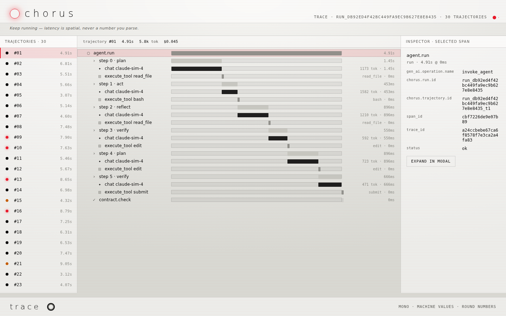

<!--
Murmur — open-source reliability harness for cheap coding agents.
-->

# Murmur

> **Run cheap coding agents many times, verify them, and ship only the proven patch.**

Murmur is an open-source reliability harness for cheap coding agents. It turns
one task into many isolated attempts, runs them through a typed workflow DAG,
verifies outputs with tests and adversarial checks, and returns the best patch
with a full proof package. Instead of trusting one expensive model run, Murmur
manufactures reliability from cheap/open models through fan-out, tournament
selection, repair loops, taint-aware tool control, and replayable traces.

**Frontier models buy intelligence. Murmur buys reliability through process.**

> Murmur was previously developed under the codename **Chorus**. The Python
> package and CLI are now named `murmur`. Everything user-facing is Murmur.

---

## How it works

```text
You give Murmur a task and a test command
    ↓
Contract compiler turns it into a measurable contract (acceptance + budget)
    ↓
Planner emits a typed Workflow IR (DAG of operators — data, not code)
    ↓
Runtime spawns N isolated attempts, each in its own sandbox
    ↓
Attempts are tested, repaired, ranked, and adversarially verified
    ↓
Winner is returned with a proof package: patch + trace + evidence
```

### Why Murmur?

| Approach | What it optimizes | Model requirement | Cost |
|---|---|---|---|
| Orchestration frameworks (LangGraph, CrewAI, AutoGen) | How agents talk | Any | Medium |
| One frontier agent run | Single-shot intelligence | Frontier only | High |
| **Murmur** | **How you know the answer is correct** | **Cheap / local** | **Pennies or free** |

### Core idea

A coding agent's output is a **distribution**, not one trajectory. One cheap
attempt is unreliable — but cheap models are cheap enough to run 10–50 times.
Independent attempts plus test verification plus adversarial review can beat a
single expensive attempt. Murmur never says "the agent succeeded." It says:

```text
Out of 20 independent attempts:
- 6 passed public tests
- 3 survived adversarial verification
- 1 had the smallest safe diff
- pass@1 = 0.30, projected pass^5 = 0.83
- cost = $0.42
- divergence usually happened during file localization
```

---

## Screenshots

**Workflow Workbench** — interactive Three.js workspace for composing and
visualizing multi-agent workflow DAGs:



**Reliability Fan Report** — pass@1 / pass^k curves with divergence overlay,
judgment cascade, and failure diagnosis from a multi-trajectory fan-out:



**Trace Viewer** — span waterfall with per-trajectory timelines, token
accounting, and an interactive inspector for every step of every run:



---

## Architecture

```
Task → Contract → Planner → Workflow IR (typed DAG) → Runtime → Verifiers → Proof
```

- **Contract compiler** — turns a messy task into a measurable contract:
  reproduction command, acceptance predicates, and cost/latency budgets.
- **Planner** — selects or generates a workflow template (coding repair,
  strategy research, document review, or free-form) and emits a
  schema-validated `WorkflowPlan`. The planner emits only typed Workflow IR —
  never Python, shell, or arbitrary code.
- **Workflow IR** — a typed DAG of operator nodes (`classify`, `map`,
  `generate`, `exec`, `loop`, `filter`, `tournament`, `verify`, `rank`,
  `reduce`, `report`). Structured data, not code — safe, inspectable, and
  replayable.
- **Runtime** — walks the DAG, enforces budgets, writes every node event to an
  append-only log, and quarantines tainted outputs unless policy allows them.
- **Sub-agents** — each attempt is an isolated actor with its own context,
  budget slice, and sandbox. No shared state between competitors.
- **Model & tool gateway** — every model call, tool call, file read, patch, and
  shell command goes through one choke point, so it can be recorded, policed,
  and replayed. Adapters target DeepSeek, Ollama, and any OpenAI-compatible API.
- **Judge & verifier stack** — deterministic checks first (tests, lint,
  contract predicates), then structural checks (diff size, touched files),
  cross-run convergence, adversarial verification, and a human gate only for
  high-risk, low-confidence results.

---

## What's included

### Contract-first code repair
- `fix-test` execution: reproduce a failing command → compile a typed contract →
  run a policy-controlled agent → verify the diff → emit proof artifacts
- Policy-controlled tools: `list_files`, `search`, `read_file`, `apply_patch`,
  `run_test`, `git_diff`, `finish`
- Dangerous operations (`.env` access, secrets, destructive shell, network,
  pushes) denied by default

### Multi-attempt orchestration
- Workflow generation from a task + test command
- Parallel sub-agent fan-out with isolated contexts
- Tournament-style ranking of competing candidates
- Adversarial verification (blind refuter per artifact)
- Closed-loop repair with test feedback
- Token budget accounting and quarantine/taint tracking
- Append-only event log for resumable runs

### Reliability & observability
- `pass@1` with Wilson CI, projected and empirical `pass^k`, divergence analysis
- Cost-aware judgment cascade (deterministic → convergence → LLM, with caching)
- Failure diagnosis with taxonomy and trace stamping
- `gen_ai.*` span waterfall trace viewer (standalone HTML, no server)
- OTLP export to LangSmith / Phoenix for production debugging
- Statistical CI gate with bootstrap regression testing

### Benchmarks
- SWE-bench Verified loader with deterministic subsets
- Single-shot vs self-repair scaffold comparison
- Integrated and batch evaluation paths

### Trace import
- OpenAI Agents SDK, Claude Code, Google ADK, and LangGraph traces can be
  normalized into the Murmur event log for unified analysis

---

## Quick start

**Requirements:** Python 3.12+

```bash
python3 -m venv .venv
source .venv/bin/activate
pip install --upgrade pip
pip install -e ".[dev]"
```

Run tests and lint:

```bash
pytest
ruff check murmur tests
```

### Try it

**Fix a failing test** (contract-first, single or multi-candidate):

```bash
murmur fix-test --cmd "python -m pytest tests/test_checkout.py -q" --budget 0.50
```

**Fan out a multi-trajectory reliability run:**

```bash
murmur run --n 30 --success-rate 0.7 --error-rate 0.1 --seed 7
```

**Render the trace viewer:**

```bash
murmur trace --n 30 --seed 7 --replay
```

**Gate CI on statistical regression** — not "did one run pass," but "did
reliability get worse compared with main":

```bash
murmur gate --branch main --n 20 --update-baseline
murmur gate --branch main --n 20 --scaffold worse --success-delta -0.12
```

**Generate a workflow plan from a task:**

```bash
murmur workflow plan --task "Fix the checkout discount bug" \
  --cmd "python -m pytest tests/test_checkout.py -q" --attempts 5 --max-repairs 3
```

See [docs/quickstart.md](docs/quickstart.md) for the full walkthrough and
[docs/github-action.md](docs/github-action.md) for CI integration.

---

## Who this is for

Reliable AI engineering should not require a $200/month frontier model or a
private enterprise platform. Murmur is built for students, open-source
maintainers, indie hackers, small startups, researchers who need reproducible
traces, and anyone running local models through Ollama. The mission: make AI
agent reliability observable, affordable, and reproducible.

---

## Project status

Working and tested locally:

- Multi-agent workflow planner and runtime
- Contract-first `fix-test` with proof packages
- Reliability fan-out with distribution-aware metrics
- Trace viewer, fan report, and divergence overlay
- Statistical CI gate with bootstrap regression testing
- SWE-bench harness wiring (fake models/evaluators)
- External trace importers (OpenAI, Claude Code, ADK, LangGraph)

In progress:

- Real `ModelPort` adapters (OpenAI-compatible / Ollama / fake) behind the gateway
- True parallel DAG scheduling in the runtime
- LLM planner mode and candidate-workflow tournaments

Not yet publicly validated:

- Paid SWE-bench benchmark with a real frontier model and Docker evaluator.
  Murmur refuses to print a number unless a real evaluation actually ran.

---

## Repository

```
https://github.com/Zwc-11/Murmur-ai-harness
```
