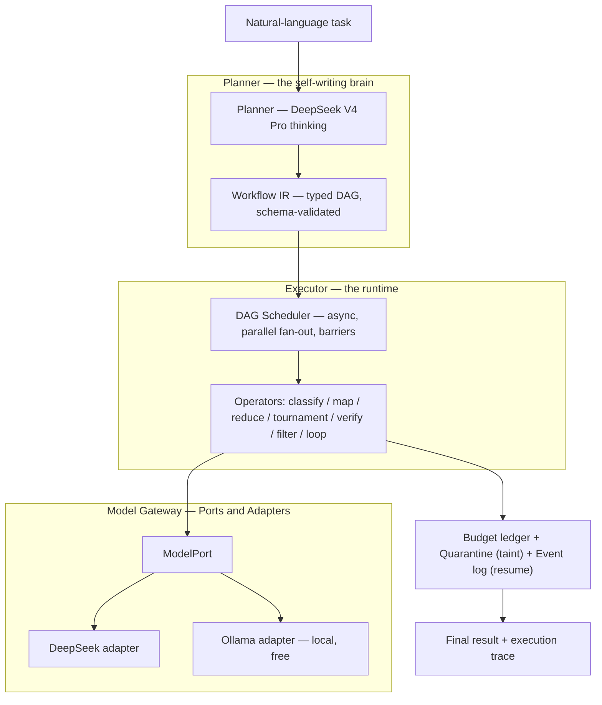
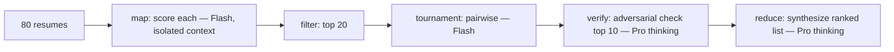
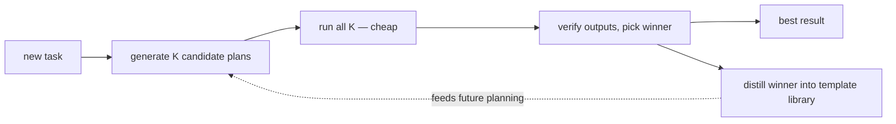

# Murmur — A Self-Writing Multi-Agent Harness for Cheap Models
### Architecture, design patterns, and the (ambitious) build plan

*(name is a placeholder — "Murmur" as in murmuration, thousands of cheap birds flocking into one intelligent shape. You could also reuse "Murmur.")*

---

## 0. What it is, in one paragraph

You give Murmur a task and a cheap model (DeepSeek V4, or a local model via Ollama). A **planner** reads the task and writes its own task-specific workflow — a plan that says "fan this out, run a tournament here, adversarially double-check there, loop until done." A **runtime** then executes that plan by spawning many small subagents, each in its own isolated context, running in parallel, and merging their results. It's the Claude Code "dynamic workflows" idea, rebuilt for models that are ~100× cheaper — so the expensive patterns Anthropic tells you to ration become the ones you run by default.

---

## 1. The one idea that makes it not generic

A hand-wired multi-agent graph (LangGraph, CrewAI) is *static* — the developer codes the steps. Claude Code's dynamic workflows are *self-writing* — the model designs the steps per task — but they're closed and only run well on expensive frontier models. Murmur takes the self-writing paradigm and aims it at cheap/open models. Two consequences fall out of "cheap":

1. **Heavy patterns become the default.** Fan-out, tournaments, and adversarial verification cost real money on Opus; on DeepSeek Flash they're pennies. So you manufacture reliability through *volume* instead of paying for a smarter model.
2. **You can afford to write the workflow more than once.** Which unlocks the ambitious endgame in §7: generate several candidate workflows, run them all, keep the best — and learn from it.

---

## 2. Architecture

The spine is a **compiler/interpreter**: natural language → a planner that "compiles" it into a typed plan (an IR) → an interpreter that executes the plan. Everything else hangs off that.



The layers, and what each is responsible for:

- **Model Gateway.** One `ModelPort` interface; adapters for the DeepSeek API and Ollama (both OpenAI-compatible). The harness never knows which model it's talking to — swapping DeepSeek for a local Qwen is a one-line config change.
- **Planner.** Runs once with the strong thinking model. Turns the task into a `WorkflowPlan`. Constrained to emit a plan that passes schema validation — it can't hand you garbage that crashes the runtime.
- **Workflow IR.** The typed plan (see §3). The single source of truth the runtime executes. Structured data, *not* code.
- **Scheduler.** Walks the plan's DAG, runs independent nodes concurrently, and treats every "merge" node as a barrier that waits for its inputs.
- **Operators.** The PDF's patterns, implemented once each as reusable execution primitives.
- **Governance.** Token-budget accounting, the quarantine/taint rule, and the append-only event log that makes runs resumable.

---

## 3. The Workflow IR (the plan)

Critical design choice: Claude Code executes LLM-generated **JavaScript**. Murmur's planner emits a **structured plan** instead, and the runtime *interprets* it. No arbitrary code execution — which is safer, far simpler to build, and trivially validatable with a schema.

A plan is a DAG of nodes. Each node is one operator:

```yaml
WorkflowPlan:
  goal: str
  budget_tokens: int                  # hard cap for the whole run
  nodes: [Node]

Node:
  id: str
  op: classify | map | reduce | tournament | verify | filter | loop
  role: str                           # the subagent's prompt/instructions
  inputs: [node_id]                   # dependencies (define the DAG edges)
  model: deepseek-v4-flash | deepseek-v4-pro | ollama:<name>
  effort: low | high                  # routes cheap vs. thinking
  trust: trusted | untrusted          # quarantine flag
  params: {}                          # op-specific (loop stop condition, bracket size, top_k…)
```

Each operator maps to a known pattern:

| Operator | What it does | PDF pattern |
|---|---|---|
| `classify` | route the task / pick a branch or model | Classify-and-act |
| `map` | spawn N isolated subagents in parallel | Fan-out |
| `reduce` | barrier: wait for inputs, merge their outputs | Synthesize |
| `tournament` | pairwise bracket; comparative judgment | Tournament |
| `verify` | spawn a refuter per artifact to attack it | Adversarial verification |
| `filter` | generate many, keep the best by rubric | Generate-and-filter |
| `loop` | repeat until a stop condition is met | Loop until done |

---

## 4. Design-pattern catalog

Every pattern below is load-bearing — none is decoration.

| Pattern | Where it lives | Why it's the right fit |
|---|---|---|
| **Compiler / Interpreter** | Planner → IR → Executor | The planner compiles intent into a plan; the executor interprets it. This is the spine. |
| **Ports & Adapters (Hexagonal)** | Model Gateway | Domain depends on `ModelPort`; DeepSeek/Ollama are interchangeable adapters → model-agnostic. |
| **Actor model** | Subagents | Each subagent is an isolated actor with private context, communicating only via structured messages. This *is* the context-isolation mechanism. |
| **DAG scheduler / Pipes & Filters** | Executor | The plan is a dependency graph; independent nodes run in parallel, merges are barriers. |
| **Map-Reduce** | fan-out → synthesize | Classic split/aggregate; the reduce node is the barrier. |
| **Command** | every node | A node is an executable, loggable, replayable command object. |
| **Composite** | nested workflows | A node can itself be a sub-workflow; operators compose. |
| **Strategy** | operators + model routing | Each primitive and each model/effort choice is a swappable strategy. |
| **Template Method** | operator execution | Each operator defines the skeleton (spawn → run → collect); the role/prompt fills it in. |
| **Decorator** | model calls | Wrap each call with budget accounting, retry, and caching. |
| **Event Sourcing + Memento** | resumability | Append every node start/finish to a log; on resume, replay to skip completed nodes. |
| **Circuit Breaker / Retry+backoff / Bulkhead / Semaphore** | resilience | Survive rate limits and failures; cap parallelism so you don't melt the API or your laptop. |
| **Taint tracking (Information-Flow Control)** | quarantine | Untrusted-content nodes are tainted and barred from feeding privileged/action nodes. |

---

## 5. Worked example: "rank these 80 resumes for a backend role, double-check the top 10"

The planner emits this plan:

```yaml
goal: rank 80 resumes for a backend role; verify the top 10
budget_tokens: 200000
nodes:
  - id: score      op: map         inputs: [resumes]  model: deepseek-v4-flash  effort: low
                   role: "Score this resume against the backend rubric. Return JSON {score, reasons}."
  - id: shortlist  op: filter      inputs: [score]    params: {top_k: 20}
  - id: bracket    op: tournament  inputs: [shortlist] model: deepseek-v4-flash
                   role: "Which candidate is stronger for the backend role? Pick one, give a reason."
  - id: check      op: verify      inputs: [bracket]  model: deepseek-v4-pro    effort: high
                   params: {top_k: 10}
                   role: "Adversarially challenge this ranking against the rubric. Flag weak or contested picks."
  - id: report     op: reduce      inputs: [check]    model: deepseek-v4-pro    effort: high
                   role: "Synthesize the final ranked list with reasons and a 'contested' flag where verification disagreed."
```



Cost shape: ~80 cheap Flash calls (scoring) + ~30 (tournament) + ~10 Pro calls (verify) + 1 Pro (synthesis). On DeepSeek that's pennies, or free inside the signup grant. On Opus that's the token blowout the article warns about — which is precisely why a cheap-first harness is a *different* product, not a clone.

---

## 6. The reliability mechanics (why isolation + cheapness work together)

The PDF names three failure modes of a single long context: **agentic laziness** (stops early), **self-preferential bias** (rubber-stamps its own work), and **goal drift** (loses the original constraints after compaction). Murmur fights all three structurally:

- **Isolation (actor model).** Every subagent gets a *fresh* context with one focused goal and no shared history, so it can't get lazy across 50 items, can't see its own prior output to favor it, and can't drift — there's nothing to drift from.
- **Adversarial verification as a separate actor.** The refuter never sees the producer's rationale (blind), only the artifact and the rubric — which is the honest version of the verifier problem we discussed earlier.
- **Budget as a first-class object.** A ledger debits every call; a node can't exceed its slice, and the run halts at the global cap (a circuit breaker).
- **Quarantine via taint.** Any node reading untrusted input is marked `untrusted`; the scheduler refuses to let a tainted output flow into a privileged/action node. (This is information-flow control — the same principle as the CaMeL line of work.)
- **Resumability via event log.** Each node emits start/finish events to an append-only log; killing the process and resuming replays the log and skips finished nodes — and cached node outputs make reruns nearly free.

---

## 7. The crazy plan (phased — each phase ships on its own)

| Phase | Goal | What you build | Done when |
|---|---|---|---|
| **0 — Gateway** | talk to a model | `ModelPort` + DeepSeek and Ollama adapters; one subagent call | "hello world" runs on both DeepSeek and a local model |
| **1 — Runtime** | execute a *hand-written* plan | the 7 operators + the DAG scheduler (async, barriers, semaphore) | a plan YAML you wrote by hand runs end-to-end in parallel |
| **2 — Self-writing** | the model writes the plan | the Planner (template-fill first, then free-form) + schema validation | the resume demo works from a plain English prompt |
| **3 — Hardening** | make it trustworthy | budget ledger, taint/quarantine, event-log resume, trace view | a run survives a kill-and-resume and respects its token cap |
| **4 — The crazy part** | make it *improve itself* | candidate-plan tournament + template mining | new tasks get faster/better as the library grows |

**Phase 4, expanded — this is the flex.** Because the model is cheap, for a new task you don't write *one* workflow — you generate **K candidate workflows**, run them all, verify their outputs, and keep the winner. Then you **distill the winning plan into a reusable template** (exactly what the article means by "treat workflows as templates" and "mine sessions, distill into rules"). Over time Murmur builds its own library of proven workflow shapes per task type, so planning gets better and cheaper the more it's used. A harness that learns which harnesses work.



Phase 1–2 is already a real, demoable open-source tool. Phase 4 is the headline.

---

## 8. Honest positioning (so you can defend it)

Be straight in your README: static multi-agent orchestration already exists (LangGraph, CrewAI, AutoGen) and local-model agents exist (OpenCode, Aider). What is *not* a shipped, known open-source thing is the **dynamic, self-writing** paradigm aimed at **cheap/open models**, plus the **self-improving template library**. You're not claiming to invent multi-agent systems — you're bringing the brand-new self-writing-workflow idea (closed and frontier-only today) to everyone who can't afford Opus. That's a real, defensible contribution, and it's a genuine open-source mission.

---

## 9. Cost reality

Planner: one DeepSeek V4 Pro thinking call per task. Subagents: many Flash calls. The whole thing is OpenAI-compatible, so the same code runs against the DeepSeek API for pennies or a local Ollama model for free. Your first full runs fit inside the free signup token grant. This is one of the cheapest ambitious systems projects you could pick.